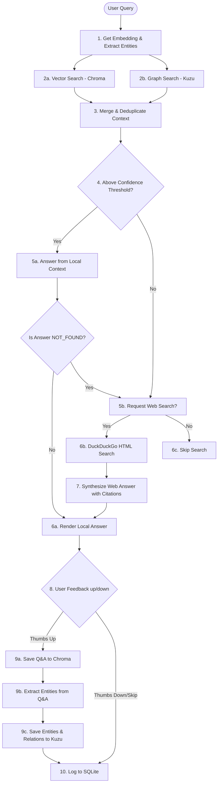

# 🕸️ AliveGraphRAG

> Self-improving hybrid GraphRAG engine powered by ChromaDB & KuzuDB · Multi-provider LLM · Web search fallback · SQLite feedback loop

[](https://www.python.org/)
[](https://github.com/chroma-core/chroma)
[](https://github.com/kuzudb/kuzu)
[](https://opensource.org/licenses/MIT)

---

## 📖 Overview

**AliveGraphRAG** is a lightweight, self-improving hybrid GraphRAG (Retrieval-Augmented Generation) engine. By coupling a dense vector database (ChromaDB) with a semantic graph database (KuzuDB), it delivers contextual accuracy on factual comparisons, entity relations, and multi-hop queries. It features a self-improving memory loop powered by user feedback and a web search fallback.

## Screenshots


---

## 🏗️ Architecture Flow



---

## ✨ Features

- **Hybrid Context Retrieval**: Merges similarity-based text chunks (vector space) with structured entity connections and 1-hop relationships (graph space) to build a robust context prompt.
- **Dynamic Multi-Provider LLM Client**: Dynamically routes requests through the available environment API keys (supporting **Nvidia NIM**, **OpenRouter**, **Groq**, and standard local server configurations).
- **Web Search Fallback**: Automatically requests permissions to query web search (using a resilient DuckDuckGo HTML search backend) when local databases fall short of the confidence threshold.
- **Self-Improving Write-back Memory**: When you thumbs-up (`u`) a response, the engine embeds the Q&A text, runs entity/relationship extraction, and writes it back to both database backends for future retrieval.
- **SQLite Interaction Logging**: Automatically logs all user interactions, sources, answers, and ratings in an SQLite feedback database (`logs/interactions.db`).

---

## 🛠️ Tech Stack

- **Vector Database**: [ChromaDB](https://github.com/chroma-core/chroma) (utilizing Cosine similarity metrics)
- **Graph Database**: [KuzuDB](https://github.com/kuzudb/kuzu) (in-memory & disk-based embedded graph engine)
- **Embeddings Model**: `BAAI/bge-small-en-v1.5` (running on CPU)
- **Terminal UI**: `prompt_toolkit` (for up-arrow command history) & `rich` (for terminal styling)
- **HTTP Client**: `httpx` (raw HTTP requests for maximum SDK compatibility)

---

## 📦 Directory Structure

```
AliveGraphRAG/
├── data/
│   ├── chroma_db/      # Vector store database files (auto-created)
│   └── kuzu_db/        # Graph database files (auto-created)
├── logs/
│   └── interactions.db # SQLite user feedback database (auto-created)
├── src/
│   ├── config.py       # Configuration parser for YAML + ENV
│   ├── embedder.py     # BGE Embeddings generator
│   ├── entity_extractor.py # LLM-based entity & relation extraction
│   ├── feedback_store.py   # SQLite logger and feedback DB initializers
│   ├── graph_store.py      # KuzuDB Cypher query interface and table schemas
│   ├── llm_client.py   # Unified API requester (Nvidia, OpenRouter, Groq)
│   ├── models.py       # Pydantic schemas (Citations, Response, Entities)
│   ├── prompts.py      # System prompts (Context QA, Web Synthesis)
│   ├── rag_pipeline.py # RAG Hybrid pipeline orchestrator
│   └── web_search.py   # DuckDuckGo HTML search provider
├── config.yaml         # Configurable parameters (thresholds, model)
├── requirements.txt    # Dependency requirements
└── main.py             # REPL Terminal Entrypoint
```

---

## 🚀 Setup & Installation

### 1. Configure Environment Variables
Create a `.env` file in the root directory:
```env
# API Keys (Precedence: NVIDIA_API_KEY > OPENROUTER_API_KEY > GROQ_API_KEY)
NVIDIA_API_KEY=your_nvidia_nim_key
OPENROUTER_API_KEY=your_openrouter_key
GROQ_API_KEY=your_groq_key
```

### 2. Configure YAML Options
Review the parameters in `config.yaml` to adjust thresholds or local storage directories:
```yaml
llm:
  model: "llama-3.3-70b-versatile"
  temperature: 0.2
  max_tokens: 1024

embedding:
  model: "BAAI/bge-small-en-v1.5"

retrieval:
  vector_threshold: 0.55   # Min similarity to consider local knowledge valid
  top_k_vector: 4
  top_k_graph: 3
```

### 3. Install Dependencies
Run the installation in your conda or python environment:
```bash
conda activate agentAPI
pip install -r requirements.txt
```

### 4. Run the Engine
Run the interactive REPL CLI:
```bash
python main.py
```

---

## 💡 Usage Example

1. **Empty Database Query** (Forces Web Fallback):
   ```
   [You] > Tell me about the apple fruit?
   [RAG] I don't have anything on that. Should I check online? [y/n]
   [y/n] > yes
   [RAG]
   Apples are round, edible fruits grown on apple trees (Malus domestica) [1]. They are highly nutritious...
   Citations:
     [1] Apple - Wikipedia — https://en.wikipedia.org/wiki/Apple
   
   Was this helpful? [u]p / [d]own (or press Enter to skip)
   [u/d] > u
   Saved to knowledge base.
   ```

2. **Recall Query** (Queries local database directly without web requests):
   ```
   [You] > Tell me about the apple fruit?
   [RAG]
   Apples are round, edible fruits grown on apple trees (Malus domestica). They are highly nutritious...
   ```
